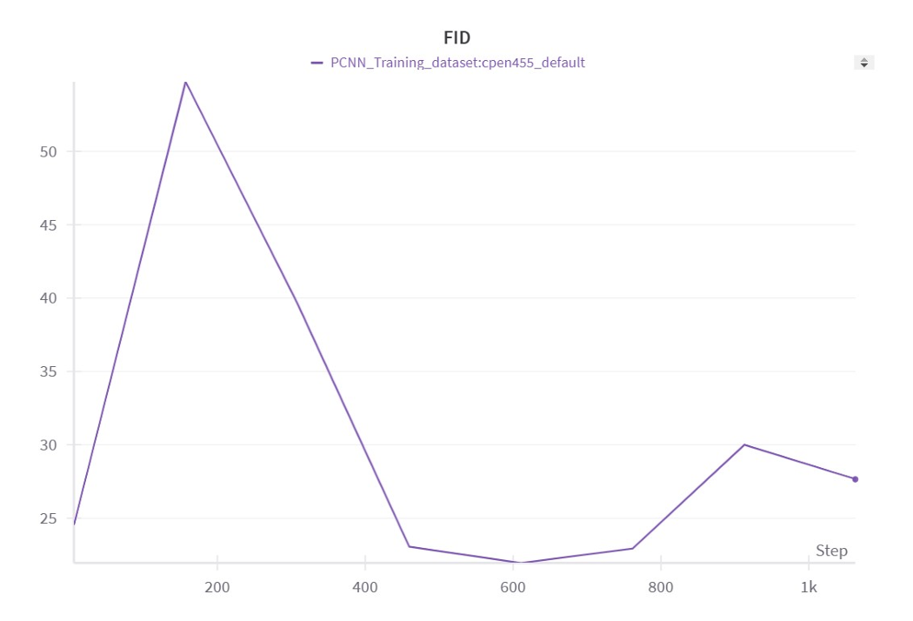
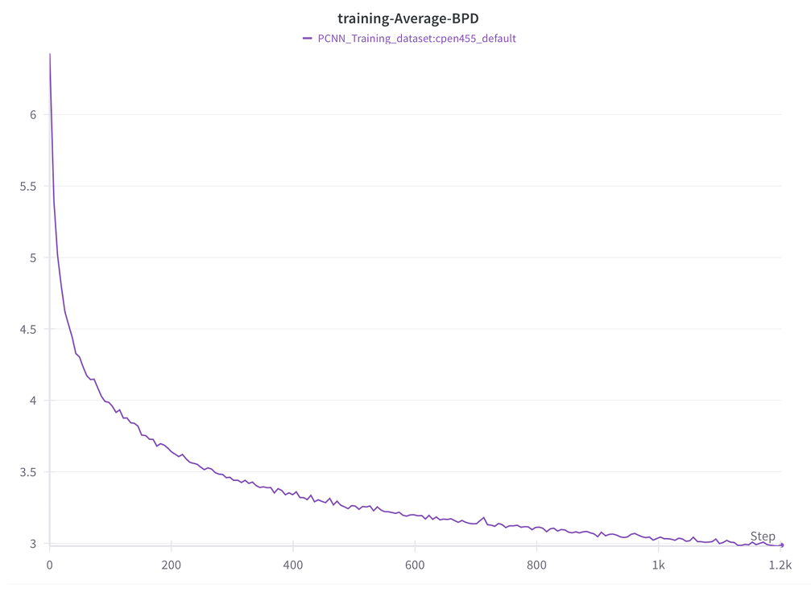
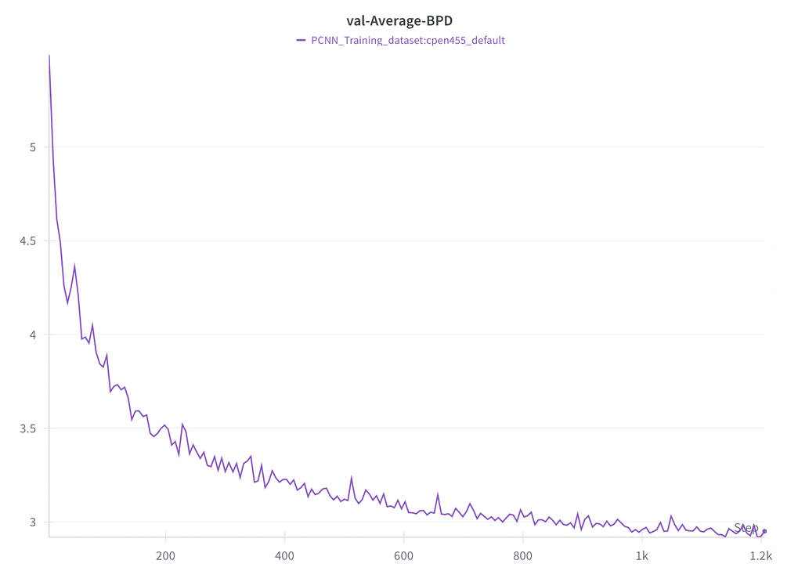
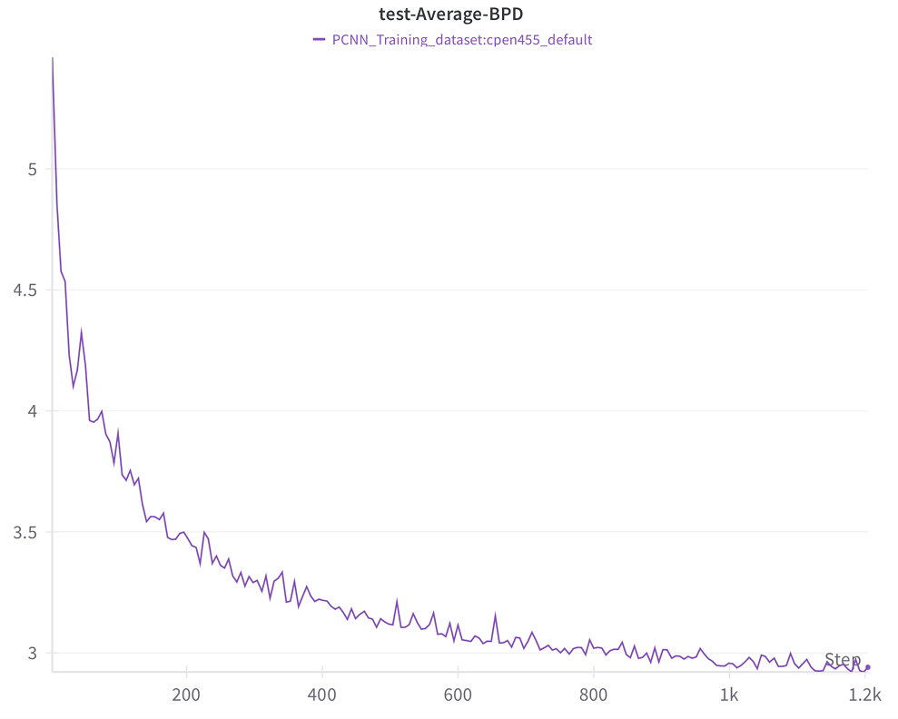

# Conditional PixelCNN++ for Image Generation and Classification

**Arunark Singh**  
CPEN 455 – Deep Learning, University of British Columbia

---

## Abstract

Generative models have achieved impressive results in high-quality image synthesis, yet unconditional architectures lack controllability for many real-world tasks.  
In this project, I extend **PixelCNN++** to a **conditional generative model** capable of both **class-conditional image generation** and **zero-shot image classification** using likelihood-based inference.

The model integrates **early fusion** and **FiLM-style middle fusion**, enabling strong conditioning and improved performance across both generation quality and classification accuracy.

---

## Project Overview

PixelCNN++ is an autoregressive generative model that estimates a tractable likelihood over images.  
While powerful, the original formulation is **unconditional** and cannot explicitly control generated content.

In this project, I extend PixelCNN++ to condition on class labels, enabling:
- Controlled image generation
- Zero-shot image classification via conditional likelihood comparison

This work was completed as the final project for **CPEN 455 (Deep Learning)**.

---

## Model Architecture

The conditional PixelCNN++ models the distribution:

p(x | c) = ∏ p(x_i | x_<i, c)

where \( c \) is a learned class condition.

### Conditioning Strategies Explored

I evaluated multiple conditioning strategies:

1. **Only Middle Fusion**  
   Conditional information added to intermediate feature maps via a 1×1 convolution.

2. **Early + Middle Fusion**  
   Condition concatenated with the input image and injected into intermediate layers.

3. **Early + FiLM-Based Middle Fusion (Final Model)**  
   Conditional signal injected using **FiLM modulation**, learning per-channel scaling (γ) and shifting (β):

FiLM(h) = γ(c) · h + β(c)

This configuration yielded the strongest generative and classification performance.

---

## Experimental Configurations

Two configurations were evaluated for the final FiLM-based model:

| Configuration | Filters | Epochs |
|---------------|---------|--------|
| A             | 40      | 500    |
| B (Final)     | 160     | 200    |

Increasing the number of filters significantly improved feature expressiveness and downstream performance.

---

## Results

**Validation Performance Summary**

| Fusion Strategy | FID ↓ | Accuracy ↑ |
|-----------------|-------|------------|
| Only Middle Fusion | 44 | 54% |
| Early + Middle Fusion | 32 | 58% |
| Early + Middle Fusion (FiLM, A) | 29 | 65% |
| **Early + Middle Fusion (FiLM, B)** | **28** | **74%** |

The **FiLM-based Early + Middle Fusion (Configuration B)** achieved the best overall results, demonstrating the importance of strong conditioning and higher model capacity.

## Training and Evaluation Curves

### Fréchet Inception Distance (FID)
Lower FID indicates higher-quality generated images.  
The Early + FiLM Middle Fusion model achieves the lowest FID during training.

<p align="center">
  
</p>

---

### Training Average Bits-Per-Dimension (BPD)
Training BPD steadily decreases, demonstrating stable convergence of the autoregressive model.

<p align="center">
  
</p>

---

### Validation Average Bits-Per-Dimension (BPD)
Validation BPD closely follows training trends, indicating good generalization.

<p align="center">
  
</p>

---

### Test Average Bits-Per-Dimension (BPD)
Test BPD confirms that the trained conditional PixelCNN++ generalizes well to unseen data.

<p align="center">
  
</p>

---

## Evaluation

### Image Generation
- Evaluated using **Fréchet Inception Distance (FID)**
- Generated 100 images (25 per class)
- Samples saved to `./samples/`

### Classification
- Performed **zero-shot classification**
- Class predicted by maximizing conditional log-likelihood
- No dedicated discriminative classifier used

---

## Tech Stack

- Python
- PyTorch
- PixelCNN++
- NumPy, Matplotlib
- Weights & Biases (for logging and visualization)

---

## Running the Model

### Environment Setup
```bash
conda create -n cpen455 python=3.10
conda activate cpen455
pip install -r requirements.txt
